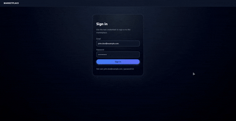

## Marketplace React Technical Assessment

This repository contains a full‑stack marketplace assessment with:

- **Backend**: Node/Express mock API in `backend`
- **Frontend**: React + Vite app in `frontend`

The focus is on authentication, products, cart, and clean UI/UX.

### Preview

### Getting Started

- **Backend**

  - `cd backend`
  - `npm install`
  - `npm start`

- **Frontend**
  - `cd frontend`
  - `npm install`
  - `npm run dev`

Then open the frontend URL shown in the terminal (by default `http://localhost:5173`) and log in using the credentials from `frontend/ASSESSMENT.md`.
